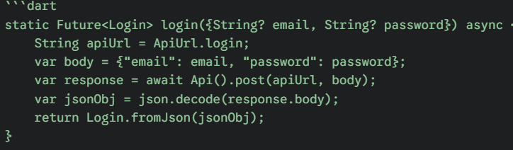
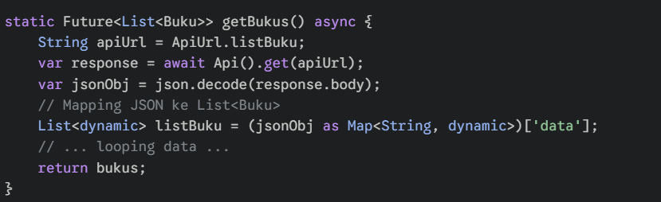
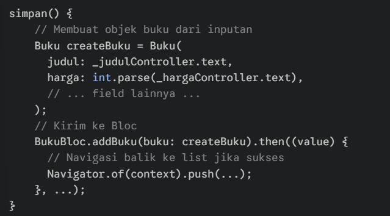
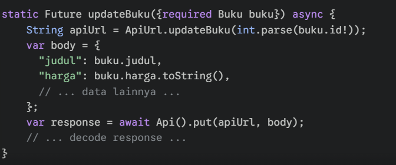
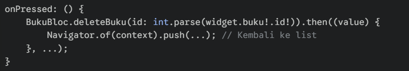

# Laporan Tugas 9 / Responsi 2 - Inventaris Buku

**Nama:** Khaila Salsa Marfah Bilqis  
**NIM:** H1D023030  
**Shift:** H / Shift C  
**Mata Kuliah:** Praktikum Pemrograman Mobile  

---

## 📝 Deskripsi Proyek
Aplikasi ini adalah sistem **Inventaris Buku** untuk supermarket. Aplikasi dibangun menggunakan **Flutter** sebagai Frontend dan **CodeIgniter 4** sebagai Backend (REST API). Aplikasi ini memiliki fitur lengkap: Autentikasi (Login/Logout) dan CRUD (Create, Read, Update, Delete) data buku.

---

## 🚀 Penjelasan Proses & Kode (Login & CRUD)

Berikut adalah dokumentasi langkah demi langkah sesuai instruksi tugas.

### 1. Proses Login
Fitur untuk masuk ke dalam sistem inventaris.

**a. Tampilan Form & Input**
Pengguna memasukkan Email dan Password pada form login.

*(Penjelasan: Form login meminta input kredensial user)*

**b. Validasi & Respon Sukses**
Jika login berhasil, sistem akan menyimpan Token akses dan mengarahkan ke halaman Inventaris.

String apiUrl = ApiUrl.login;: Mengambil alamat URL endpoint login yang sudah didefinisikan di file helper (misal: .../login).

var body = {...};: Membungkus data email dan password menjadi format Map (kunci-nilai) agar bisa dikirim.

await Api().post(apiUrl, body);: Mengirim data tersebut ke server menggunakan metode POST. Kata kunci await berarti aplikasi akan menunggu sampai server membalas.

json.decode(response.body);: Mengubah balasan server (yang aslinya teks JSON mentah) menjadi objek yang bisa dibaca oleh Dart/Flutter.

return Login.fromJson(jsonObj);: Mengubah data JSON tadi menjadi Objek Model Login (yang berisi token, userID, dll) agar mudah dipakai di aplikasi.

Proses Menampilkan Daftar Buku (Read)
Menampilkan seluruh data inventaris buku yang ada di database.

a. Tampilan List Data diambil dari API menggunakan FutureBuilder dan ditampilkan dalam list. (Penjelasan: Daftar buku beserta stok dan harga ditampilkan)

ApiUrl.listBuku: Mengambil URL endpoint untuk melihat data (misal: .../buku).

Api().get(apiUrl): Melakukan permintaan data ke server menggunakan metode GET (hanya mengambil data, tidak mengirim data).

['data']: Biasanya respon API dibungkus dalam key bernama "data". Baris ini mengambil isi array buku tersebut.

(Bagian looping): Kode ini (yang disingkat) bertugas mengubah setiap item JSON mentah menjadi Objek Buku satu per satu dan memasukkannya ke dalam list.

Proses Tambah Inventaris (Create)
Menambahkan data buku baru ke dalam sistem.

a. Form Tambah Pengguna menekan tombol (+) dan mengisi 7 kolom data buku (Judul, Harga, Jumlah, dll). (Penjelasan: Form input data buku baru)

b. Simpan Data Saat tombol SIMPAN ditekan, data dikirim ke server via API.

_judulController.text: Mengambil teks yang diketik pengguna pada kolom input Judul.

int.parse(...): Mengubah teks angka (String) menjadi tipe data angka murni (Integer), karena harga di database bertipe Int.

BukuBloc.addBuku(...): Memanggil fungsi logika di BLoC untuk mengirim data ke API.

.then((value) { ... }): Kode di dalam kurung kurawal ini hanya akan jalan JIKA proses simpan berhasil.

Navigator...: Perintah untuk memindahkan halaman kembali ke halaman List Produk setelah berhasil menyimpan.

Proses Ubah Data (Update)
Mengedit informasi buku yang sudah ada.

a. Form Edit (Terisi Otomatis) Dari halaman detail, klik EDIT. Form terbuka dengan data lama yang siap diubah. (Penjelasan: Form update dengan data pre-filled)

b. Eksekusi Update Tombol UBAH mengirim data revisi ke API menggunakan method PUT.

ApiUrl.updateBuku(...): Membuat URL spesifik yang menyertakan ID Buku (misal: .../buku/15). Server perlu tahu buku ID berapa yang mau diedit.

var body = {...}: Menyusun data baru yang sudah diedit user. Perhatikan harga.toString(), data dikirim dalam bentuk string ke server (nanti server yang mengolahnya).

Api().put(...): Mengirim data menggunakan metode PUT. Metode PUT khusus digunakan untuk memperbarui data yang sudah ada.

Proses Hapus Data (Delete)
Menghapus buku dari inventaris.

a. Konfirmasi Hapus Klik tombol DELETE di halaman Detail. Muncul dialog konfirmasi. (Penjelasan: Dialog konfirmasi untuk mencegah kesalahan hapus)

b. Eksekusi Hapus Jika "Ya" dipilih, data dihapus permanen dari database.

widget.buku!.id!: Mengambil ID dari buku yang sedang dibuka di halaman detail.

int.parse(...): Mengubah ID tersebut menjadi angka.

BukuBloc.deleteBuku(...): Memanggil fungsi di BLoC yang akan mengirim perintah DELETE ke server untuk menghapus data selamanya.

Navigator...: Jika server membalas "Sukses", aplikasi akan otomatis kembali ke halaman List Buku (Dashboard).